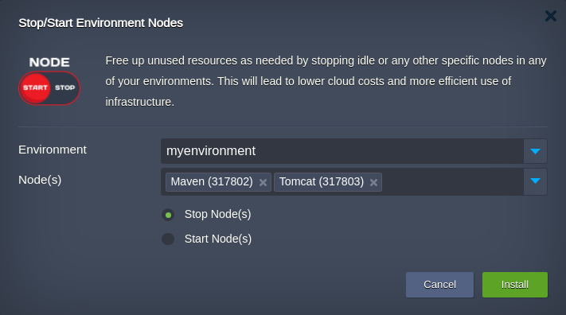

 
 

# Stop Start Node(s)

The **Stop Start Node** application is intended to shut down or launch manually any node in any environment or even several at once. Such environment lifecycle management allows to cut expenditures excluding unnecessary nodes at the moment from the operation. For example, you can stop the build node when no development is expected to be carried out (e.g. during nighttime or weekend).

The *Stop Start Node* application can be applied to any environment within your [Jelastic Cloud](https://jelastic.cloud/) account.

## How to Apply Stop Start Node Actions

Copy link to the **_manifest.jps_** file above and [import](https://docs.jelastic.com/environment-import) it to your Jelastic dashboard (or, alternatively, locate and launch this package via [Jelastic Marketplace](https://docs.jelastic.com/marketplace)).

 

Within the installation frame:  

- choose the target **Environment** which nodes should be managed  
- choose the target **Node(s)** that should be managed   
- check the required action **Stop Node(s)** or **Start Node(s)**   

> **Note** that the current implementation stipulates the complete stop/start of the specified containers in the destination environment and these actions can't be overridden by node restart; thus, the corresponding services on the destination nodes will remain unavailable until *Stop Start Node* application will be launched again with opposite action to the previous one applied. It goes without saying, that mentioned actions can be overridden with Jelastic dashboard environment [start/stop functionality](https://docs.jelastic.com/dashboard-guide/#function-icons-for-environments).            

Click **Install** to initiate the application installation.

The installation results in the information window:

 

 

